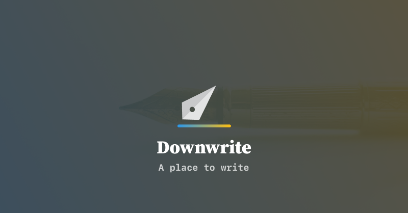
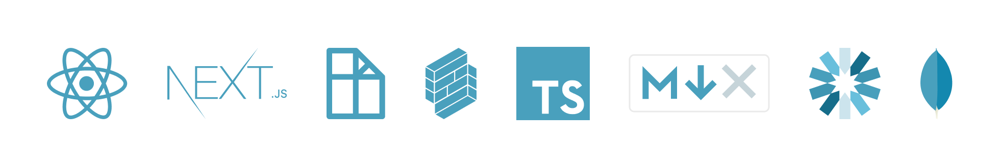

# 


## About 🤔🦄🎉

> _A place to write._ ✍️

So the idea here was simple build a simple markdown writing application. Markdown is a huge deal and all the cool tools kept getting shut down and naively,I thought, _how hard can this really be_? 🤔📝📦

So I've had poorly designed iterations of this thing for every year, on the year as one of these services got shut down. When [Canvas](https://blog.usecanvas.com/) shut down this last year, I started to get a little more serious about this idea. 💡 ⚡🔭

During planning out some of my quarterly goals at my last job I decided to go a little more full-stack with Node and start to really work through the process of building a microservice. Since I'm never really one to learning languages and frameworks in the abstract, I decided to take up Downwrite as an excuse to build those microservices. 📡💸🌎

### Why Markdown 🧐🤨📋

Markdown is probably the most efficient and universal tool for conveying syntax, semantics and structure across platforms. ⬇️

Originally coined by [John Gruber (Daring Fireball)](https://daringfireball.net/projects/markdown/) it was originally conceived as a text to HTML and is the staple of static site generators, OSS as well as a fair amount of comment sections, notetaking applications or any documentation tool. 🛠

These shortcuts are almost as ubiquitous as `cmd + b` for bold or `cmd + i` for italics. ⌨️

> Bottomline: markdown is data. It is a method for describing semantics of data and is data itself.

## Features ✨🔥🚀

This is meant to be a simple writing application with some key features:

- Write wherever you are in markdown
- Share what you've written if you want
- Upload a markdown file from your machine
- Export to a static markdown file for your blog, etc.

## Setup 📲⏳⚙️

This project uses Node (v12.18.x), [TypeScript](https://www.typescriptlang.org/) and Yarn.

```bash
brew cask install yarn
yarn
```

Personally use [`fnm`](https://github.com/Schniz/fnm) to manage my node versions.

```bash
fnm install
fnm use
```

### Environment

To get started create an `.env` file in the root of your project with the following

```env
SECRET_KEY="SECRET SECRETS ARE NO FUN"
CURRENT_DB_ADDRESS="127.0.0.1:27017/downwrite"
```

### Client ⚡️🦊



#### Setup

Run in your terminal from the root of the project.

```bash
yarn dev
```

Open [`http://localhost:3000`](http://localhost:3000/) in your browser.

#### UI 📝

This is the client-side of the application, it uses Next.js and is a pretty stock implementation of how Next handles routing to different views. 👨‍💻🤜🦑🤯

Downwrite needs to server side rendered to make sharing an entry as easy as possible. Next.js' data-fetching API makes it the perfect candidate. So when the page calls `getServerSideProps()` it fetches the data directly from the database (DB creditentials aren't exposed to the client build at all because of the bundling features inside Next 😁) and for the initial render it has data available instead of a skeleton screen. 🤖☠️💀

For the Editor this project uses Draft.js and Draft.js Plugins. Markdown syntax is used inline and autogenerates the related rich text `_hello_` becomes "_hello_" as you type.💻⌨️🔏

For styles I just used the built-in CSS support in Next.js

#### Serverless Functions 🌎✨

To update the data, this project calls endpoints at `/api/....` to enable this we're using Next'js [API Routes](https://nextjs.org/docs/api-routes/introduction). These are serverless functions so we don't need to keep a server or database connectioin running all the time, with serverless functions you're essentially calling the API on-demand.

This project also depends on MongoDB 🍍 for data persistence, you should see this [gist](https://gist.github.com/nrollr/9f523ae17ecdbb50311980503409aeb3) on how to setup MongoDB on your machine.

To authenticate we're using JWT to call the basic CRUD functions. Basically this is using a stateless auth model, more about that [here](https://auth0.com/blog/stateless-auth-for-stateful-minds/). 🔐

#### Related Documentation 📚

- [TypeScript](https://www.typescriptlang.org/)
- [React](https://reactjs.org/)
- [Next.js](https://nextjs.org/)
- [Formik](https://formik.org/)
- [Draft.js](https://draftjs.org/)
- [Draft.js Plugins](https://www.draft-js-plugins.com/)
- [Reach UI](https://reach.tech/)
- [MDX](https://mdxjs.com/)
- [MongoDB](https://docs.mongodb.com/manual/support/) & [Mongoose.js](http://mongoosejs.com)
- [JWT](https://auth0.com/blog/hapijs-authentication-secure-your-api-with-json-web-tokens/)

### Integration Testing 🌈🦁🐛


```bash
yarn test
```

#### Info 📝🧪

Short hand: `page` is just a representation of whatever the headless browser, _Puppeteer_ has rendered at that given moment.

Using Puppeteer I write assertions like this:

```js
describe("Feature", () => {
  it("does this thing", async () => {
    await page.waitForSelector("#selector");
    await page.click("#selector");
    await page.waitForSelector("#other-selector");
  });
});
```

This approach accomplishes two things:

- Ensures if an `await` statement errors or `catch()` the block will cause a failure
- Makes the test sequential and simpler to write

#### Related Documentation 📚

- [Puppeteer](https://github.com/GoogleChrome/puppeteer/blob/master/docs/api.md)
- [Jest](https://jestjs.io/)
- [_End-to-end Tests that Don’t Suck with Puppeteer_ from Trevor Miller](https://ropig.com/blog/end-end-tests-dont-suck-puppeteer/)
- [_Write tests. Not too many. Mostly integration._ from Kent C. Dodds](https://blog.kentcdodds.com/write-tests-not-too-many-mostly-integration-5e8c7fff591c)

### Workflow 👷‍♀️🚧

Working on this project it uses GitHub actions to run the tests and deploys using [`vercel`](https://vercel.com) for easy rollback and immutable deployments.

## License ⚖️💣🛡⚔️

MIT License

Copyright (c) 2020 Charles Peters

Permission is hereby granted, free of charge, to any person obtaining a copy
of this software and associated documentation files (the "Software"), to deal
in the Software without restriction, including without limitation the rights
to use, copy, modify, merge, publish, distribute, sublicense, and/or sell
copies of the Software, and to permit persons to whom the Software is
furnished to do so, subject to the following conditions:

The above copyright notice and this permission notice shall be included in all
copies or substantial portions of the Software.

THE SOFTWARE IS PROVIDED "AS IS", WITHOUT WARRANTY OF ANY KIND, EXPRESS OR
IMPLIED, INCLUDING BUT NOT LIMITED TO THE WARRANTIES OF MERCHANTABILITY,
FITNESS FOR A PARTICULAR PURPOSE AND NONINFRINGEMENT. IN NO EVENT SHALL THE
AUTHORS OR COPYRIGHT HOLDERS BE LIABLE FOR ANY CLAIM, DAMAGES OR OTHER
LIABILITY, WHETHER IN AN ACTION OF CONTRACT, TORT OR OTHERWISE, ARISING FROM,
OUT OF OR IN CONNECTION WITH THE SOFTWARE OR THE USE OR OTHER DEALINGS IN THE
SOFTWARE.
